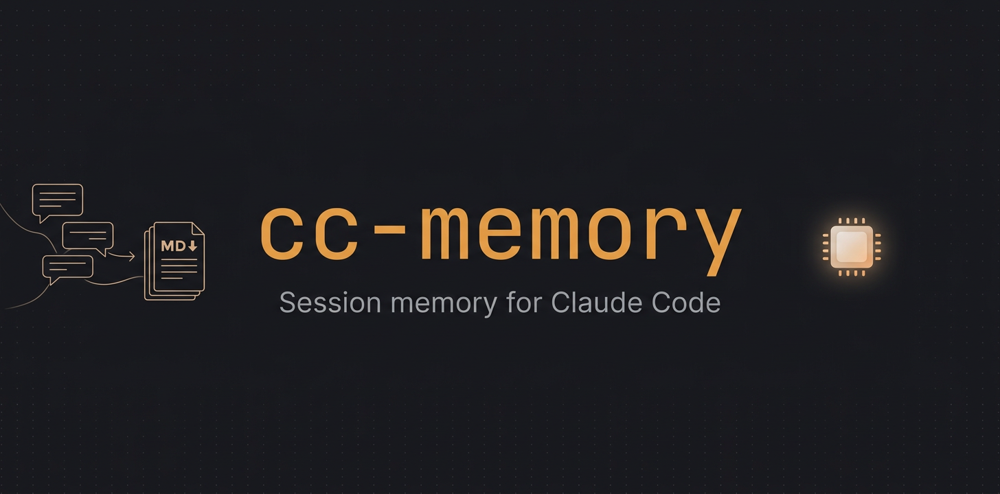
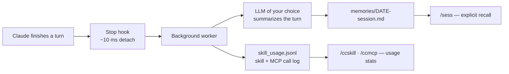

English | [简体中文](README.zh-CN.md)

<div align="center">

# cc-memory

<p align="center">
  
</p>

> *"Write should be automatic and cheap; read should be explicit and controlled."*

[](LICENSE)
[]()
[]()
[]()

<br>

**Per-turn session memory + lifetime usage analytics for Claude Code.**

<br>

One `Stop` hook, an LLM of your choice, plain markdown files.<br>
Every turn gets summarized in the background; nothing enters your context until you ask.<br>
Bonus: it quietly logs every skill and MCP call you ever make — data Claude Code itself deletes after 30 days.

<br>

[See It in Action](#see-it-in-action) · [Up and Running](#up-and-running) · [By the Numbers](#by-the-numbers) · [How It Works](#how-it-works)

</div>

---

## See It in Action

**Recall any past session — without paying a context tax every session:**

```text
You    ❯ /sess dab converter
Claude ❯ Found it — 2026-05-24, this project:
         Turn 3: tuned phase-shift on the DAB sim; ZVS lost below 0.3 p.u. load.
         Tried lowering fs first (failed — magnetics saturated), fixed it with
         dead-time 180 ns → 240 ns.
You    ❯ what was the exact error message?
Claude ❯ (sess switches to --raw and reads the original transcript) "Derivative
         of state '1' in block ... at time 0.00132 is not finite."
```

It doesn't re-feed your history into every session. Memories sit on disk until *you* pull them — summary first, lossless raw transcript when you ask for exact wording.

**Ask `/ccskill` or `/ccmcp` which tools you actually use:**

```text
$ ccmem mcp-stats          # ← /ccmcp in Claude Code
MCP server     calls   first       last        top tools
matlab         10686   2026-05-12  2026-06-10  evaluate_matlab_code×9670
tavily           706   2026-05-11  2026-06-09  tavily_search×615
filesystem       244   2026-05-14  2026-06-07  read_file×142
...
18 MCP servers, 12,232 calls total
```

Claude Code wipes raw transcripts after 30 days — this log is forever. One look told this author that a single MCP server carried 87 % of all calls and three others were dead weight.

---

## Why these tradeoffs

Inspired by [claude-mem](https://github.com/thedotmack/claude-mem), with two deliberate differences:


| Dimension | claude-mem | cc-memory |
|---|---|---|
| Hooks | 5 (SessionStart / UserPromptSubmit / PostToolUse / Stop / SessionEnd) | **1** (Stop, per-turn append) |
| Crash cost | depends on SessionEnd firing | **at most the unfinished last turn** |
| Summary engine | Claude agent-sdk | **any LLM you already pay for — or a free local one** |
| New-session injection | automatic | **none — explicit `/sess`** |
| Storage | SQLite + Chroma vector DB | **markdown + grep** |

1. **No auto-inject.** Context window is the scarcest resource a session has. Auto-injected history is a tax you pay every session whether you need it or not — and it takes the "do I want history right now?" decision away from you.
2. **No cross-project vector search by default.** Serious Claude Code use is already organized per project; cross-project semantic hits are mostly keyword collisions. `/sess` scopes to the current project, `--all` widens on demand.

---

## By the Numbers

| Metric | Value |
|---|---|
| **Hooks required** | 1 — Stop only |
| **Hook latency** | ~10 ms (worker detaches, CC never waits) |
| **Data lost on crash / `Cmd+Q`** | at most 1 unfinished turn |
| **pip installs** | 0 — Python stdlib only (`urllib` + `json` + `fcntl`) |
| **Total code** | 2,230 lines — auditable in one sitting |
| **Per-turn summary** | ~300 chars, written so another model can pick up where you left off |
| **LLM providers** | 9+ (OpenAI / Anthropic / DeepSeek / OpenRouter / Together / Groq / Ollama / vLLM / Z.AI) via 2 wire protocols, auto-sniffed |
| **Context injected per session** | 0 tokens until you ask |
| **Usage analytics retention** | unlimited — survives Claude Code's 30-day transcript cleanup |
| **Install** | ~3 minutes, Claude Code installs it for you |

---

## How It Works




**1. Detach** — Claude finishes a turn, the Stop hook writes the event to a tmpfile, forks a detached Python worker, and returns in ~10 ms. CC never blocks.

**2. Summarize** — the worker extracts the turn from CC's transcript and asks *your* LLM (any OpenAI-Chat or Anthropic-Messages endpoint) for a ~300-char summary that keeps failures and dead ends, not just the final fix.

**3. Append** — one markdown file per session, frontmatter + one section per turn, guarded by `fcntl` locks. Capacity-capped FIFO so it never eats your disk.

**4. Log usage** — on the way through, every `Skill` and `mcp__*` tool call is appended to `skill_usage.jsonl`, deduplicated by tool-call id. No extra hook, no LLM cost.

Reading is a separate, explicit path: `/sess` for memories, `/ccskill` / `/ccmcp` for usage stats, `--raw` to drop down to CC's lossless transcript.

---

## Up and Running

```bash
git clone https://github.com/Zane456/cc-session-memory.git
cd cc-session-memory
claude
```

Then paste into Claude Code:

> Please install cc-memory following section 3 of `INSTALL.md` in this repo. I'll use global mode (`--global`). Report each step and stop to ask if anything is unexpected.

That's it — Claude Code configures the hook, the config, and the `/sess`, `/sessme`, `/ccskill`, `/ccmcp` skills itself. The manual path and the full [provider matrix](INSTALL.md#provider-矩阵) (OpenAI / Anthropic / DeepSeek / Ollama / …) live in [INSTALL.md](INSTALL.md).

Switching providers later is one sentence in Claude Code: *"change my cc-memory config to deepseek."*

---

## Daily Driving

| You type | You get |
|---|---|
| `/sess` | last session in this project, summarized |
| `/sess <keyword>` | search this project's memories |
| `/sess all 3` | last 3 sessions across all projects |
| `/sessme` | **this window's own session only** — pinned by session id, never bleeds in a parallel window's memory (handy after `/clear`) |
| *"what was the exact wording last time?"* | sess auto-switches to `--raw` and reads the original transcript |
| `/ccskill` | every skill you ever called: count, first, last, project spread |
| `/ccmcp` | same for MCP servers, with per-server top tools |

The same data is scriptable from the shell:

```bash
python3 memory_system/cli/ccmem.py last-session            # summary
python3 memory_system/cli/ccmem.py find "<keyword>" --raw  # lossless search
python3 memory_system/cli/ccmem.py skill-stats --by day    # usage trends
python3 memory_system/cli/ccmem.py mcp-stats               # MCP league table
```

---

## Privacy, by construction

- **Memories never leave your machine.** `memories/` is gitignored; summaries and usage logs are plain local files you can read, grep, edit, or delete.
- **Your API key never enters git** — it lives in `~/.config/cc-memory/config.json` (chmod 600), with a `.gitignore` safety net for any stray `config.json`.
- **Failures stay quiet** — LLM errors are quarantined to a local log; the hook always exits 0 and never breaks your Claude Code session.

---

## Repository Layout

```
cc-session-memory/
├── INSTALL.md                       # install guide (start here)
├── memory_system/
│   ├── hooks/session_end.sh         # 10 ms detacher
│   ├── hooks/summarize.py           # background worker: summarize + log usage
│   ├── skill_usage.py               # shared skill/MCP call extraction (132 lines)
│   ├── cli/ccmem.py                 # retrieval + stats CLI
│   └── bin/prune_cc_transcripts.py  # cap ~/.claude/projects growth
├── skills/                          # /sess · /sessme · /ccskill · /ccmcp templates
├── memories/                        # your summaries (gitignored)
└── docs/images/
```

Full architecture rationale: [DESIGN.md](DESIGN.md).

---

<div align="center">

<br>

*Write should be automatic and cheap; read should be explicit and controlled.*

<br>

⭐ If cc-memory remembers something for you, consider giving it a star.

<br>

**Zane456** — power-electronics researcher who codes with Claude Code daily

| Platform | Link |
| :--- | :--- |
| 🐙 GitHub | [@Zane456](https://github.com/Zane456) |

<br>

MIT License © [Zane456](https://github.com/Zane456)

</div>
