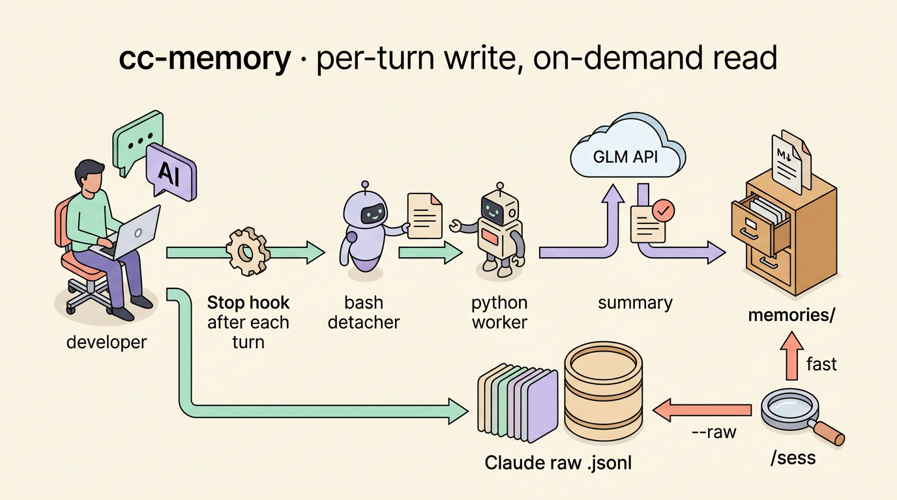
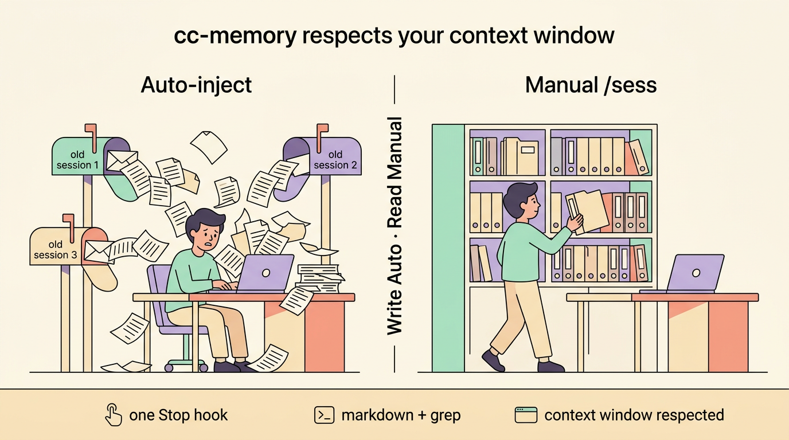

English | [简体中文](README.zh-CN.md)

<div align="center">

# cc-memory

<p align="center">
  
</p>

> *"Write auto. Read manual. That's the whole trick."*

[]()
[]()
[]()

<br>

**Per-turn session memory for Claude Code — background writes, on-demand reads.**

<br>

9 LLM providers · 1 hook · 10 ms return · zero dependencies · markdown + grep

<br>

[See It Work](#see-it-work) · [Why This Design](#why-this-design) · [Install](#install) · [Provider Matrix](#provider-matrix) · [How It Works](#how-it-works) · [Key Numbers](#key-numbers)

</div>

---

## See It Work

You finish a Claude Code session. The hook already fired — every turn is summarized.

```bash
$ python3 memory_system/cli/ccmem.py last-session

# Session: 2026-05-15-a3f8c · Project: Voice-Brother · Turns: 12
#
# [Turn 1] User asked to implement streaming ASR with 1.5s timer approach.
#   Agent chose GCD DispatchSourceTimer over Combine, referenced speech-swift API.
# [Turn 2] Attempted MLXAudioStreamBuffer wrapper. Failed — MLX array shapes
#   don't support dynamic append. Switched to ring-buffer approach.
# [Turn 3] Ring buffer working. MLX cache climbing to 2 GB — added
#   MLXMemoryGovernor with 256 MB cacheLimit + clearCache() per transcribe.
#   Active memory stable at 1.8 GB after fix.
# ...
```

Next day, new session. Pull memory only when you need it:

```
/sess
# → Last session summary loaded into context. Continue where you left off.

/sess "MLX cache"
# → Every session that mentioned "MLX cache" — grepable, project-scoped.

/sess "what was the exact error message?"
# → sess skill detects detail-seeking → auto-switches to --raw
# → reads Claude Code's own full JSONL transcript, not the lossy summary
```

This is not a vector database doing semantic search across projects.<br>
It's **one markdown file per session, grepable by design**, isolated to your current project by default.

---

## Why This Design

<p align="center">
  
</p>

Inspired by [claude-mem](https://github.com/thedotmack/claude-mem) — with two anti-consensus tradeoffs:

| | claude-mem | cc-memory |
|---|---|---|
| **Hooks** | 5 (SessionStart / UserPromptSubmit / PostToolUse / Stop / SessionEnd) | **1** (Stop — per-turn append) |
| **Write timing** | Continuous observation during session | **Once per turn** — crash loses at most 1 turn |
| **Summary engine** | Claude agent-sdk | **Any LLM** (9+ providers, see matrix below) |
| **SessionStart auto-inject** | Yes | **No** — explicit `/sess` |
| **Storage** | SQLite + Chroma vector DB | **Markdown + grep** |

**Tradeoff 1 — No cross-project memory by default.**
"Search across all projects" returns false-positive signals — keyword collisions, same-name-different-meaning concepts that dilute the current project's context. cc-memory isolates by `cwd`; `--all` extends globally only when you ask.

**Tradeoff 2 — No SessionStart auto-inject.**
Context window is scarce. Auto-injection means paying a "context-you-might-not-need" tax every session, diluting the current task's signal. In long conversations this tax forces premature compaction, losing more important info. cc-memory lets you decide: `/sess` to continue, or let memories sit quietly on disk.

> *Write should be automatic and cheap; read should be explicit and controlled.*

---

## Install

**Recommended: let Claude Code install it for you** (~3 min):

```bash
git clone https://github.com/Zane456/cc-project-memory.git
cd cc-project-memory
claude
```

Then paste the install prompt from [INSTALL.md](INSTALL.md) — Claude Code runs `setup.sh`, configures your LLM provider, and verifies everything end-to-end.

**Or manual:**

```bash
git clone https://github.com/Zane456/cc-project-memory.git
cd cc-project-memory
./memory_system/bin/setup.sh --global --key <your-LLM-api-key>
```

Full guide: [INSTALL.md](INSTALL.md).

---

## Provider Matrix

9 providers, 2 protocols, **zero lock-in**:

| Provider | endpoint | model (example) | protocol |
|---|---|---|---|
| **OpenAI** | `api.openai.com/v1/chat/completions` | gpt-4o-mini | openai |
| **Anthropic** | `api.anthropic.com/v1/messages` | claude-haiku-4-5-20251001 | anthropic |
| **DeepSeek** | `api.deepseek.com/v1/chat/completions` | deepseek-chat | openai |
| **OpenRouter** | `openrouter.ai/api/v1/chat/completions` | anthropic/claude-haiku-4-5 | openai |
| **Together** | `api.together.xyz/v1/chat/completions` | meta-llama/Llama-3.3-70B-Instruct | openai |
| **Groq** | `api.groq.com/openai/v1/chat/completions` | llama-3.3-70b-versatile | openai |
| **Ollama** (local, free) | `localhost:11434/v1/chat/completions` | qwen2.5:7b | openai |
| **vLLM** (local) | `localhost:8000/v1/chat/completions` | *your model* | openai |
| **Z.AI GLM** | `api.z.ai/api/anthropic/v1/messages` | glm-5-turbo | anthropic |

Protocol is auto-detected from URL — `/messages` or `/anthropic/` → anthropic, otherwise openai.

Switch provider after install? Tell Claude Code *"change my cc-memory config to deepseek"* — it edits the config for you.

---

## How It Works

```mermaid
sequenceDiagram
    CC as Claude Code
    H as Stop Hook (bash)
    W as Python Worker
    LLM as Your LLM

    CC->>H: Turn ends → hook fires
    H->>W: nohup detach (~10ms)
    H-->>CC: exit 0 (instant)
    W->>LLM: Summarize this turn
    LLM-->>W: ~300 chars
    W->>W: flock(LOCK_EX) → append to session.md
```

**4 things happen when Claude Code finishes a turn:**

**1. Stop hook fires** — `session_end.sh` receives the turn's transcript via tmpfile.
**2. Detaches instantly** — `nohup setsid python3 ... & disown`. Bash returns in ~10 ms. CC never waits.
**3. LLM summarizes** — Your chosen provider generates a ~300-char summary preserving specific names, failed attempts, and decision rationale.
**4. Appends to markdown** — `flock(LOCK_EX)` prevents concurrent writes from colliding. One file per session, multiple turn sections inside.

**Two-layer storage:**

| Layer | Where | Per turn | Read via |
|---|---|---|---|
| LLM summary (lossy, fast) | `memories/YYYY-MM-DD-<sid>.md` | ~300 chars | `ccmem find`, `/sess` |
| CC raw transcript (lossless) | `~/.claude/projects/<sid>.jsonl` | Full text + tool I/O | `ccmem --raw`; auto on detail-seeking phrases |

---

## Key Numbers

| Metric | Value |
|---|---|
| **Hooks** | 1 (Stop only) — minimal surface, maximal reliability |
| **Hook return time** | ~10 ms (async detach, CC never waits) |
| **Summary per turn** | ~300 chars (names, failures, decision rationale) |
| **LLM providers** | 9+ (OpenAI · Anthropic · DeepSeek · OpenRouter · Together · Groq · Ollama · vLLM · Z.AI) |
| **Dependencies** | 0 (Python stdlib only) |
| **Storage** | Markdown + grep (no vector DB, no SQLite) |
| **Capacity cap** | 200 MB, FIFO prune, last 10 sessions always kept |
| **Crash resilience** | At most 1 turn lost (window close / Cmd+Q / segfault) |
| **CLI subcommands** | 10 via `ccmem.py` |
| **Codebase** | ~800 lines Python + ~100 lines Bash |

---

## CLI Cheatsheet

```bash
ccmem last-session              # last session in current project (summary)
ccmem last-session --raw        # read CC's raw .jsonl instead
ccmem find "<keyword>"          # search current project summaries
ccmem find "<keyword>" --all    # extend to global
ccmem stats                     # disk usage
ccmem prune                     # manual FIFO prune

# Cap ~/.claude/projects/ at 3 GB:
python3 memory_system/bin/prune_cc_transcripts.py --dry-run
```

In Claude Code:
- `/sess` — load last session in current project
- `/sess <keyword>` — search summaries by keyword
- *"What was the exact error message?"* — sess skill auto-triggers `--raw` mode

---

## Repository Structure

```
cc-project-memory/
├── INSTALL.md                            # install guide (recommended entry)
├── DESIGN.md                             # full architecture spec
├── memory_system/
│   ├── hooks/
│   │   ├── session_end.sh                # bash detacher (~10 ms return)
│   │   └── summarize.py                  # python worker (LLM call, md append)
│   ├── cli/ccmem.py                      # retrieval CLI (10 subcommands)
│   ├── bin/
│   │   ├── setup.sh                      # one-shot installer
│   │   └── prune_cc_transcripts.py       # cap ~/.claude/projects at 3 GB
│   └── config/config.example.json
├── skills/sess/SKILL.md                  # /sess language-trigger skill template
├── memories/                             # LLM summaries (gitignored)
└── docs/images/                          # architecture + philosophy diagrams
```

Full architecture: [DESIGN.md](DESIGN.md).

---

<div align="center">

> *"Write auto. Read manual. That's the whole trick."*

<br>

**Zane456** — Power Electronics Researcher & AI Tool Builder

| Platform | Link |
| :--- | :--- |
| 🌐 GitHub | [Zane456](https://github.com/Zane456) |
| 𝕏 X / Twitter | [@ZaneZaneZzZZ](https://x.com/ZaneZaneZzZZ) |
| 📕 小红书 | [Zz302179383](https://www.xiaohongshu.com/user/profile/Zz302179383) |
| ✉️ Email | zz302179383@gmail.com |

<br>

⭐ If this helps your Claude Code workflow, star the repo — it helps others find it.

<br><br>

MIT License © [Zane456](https://github.com/Zane456)

</div>
