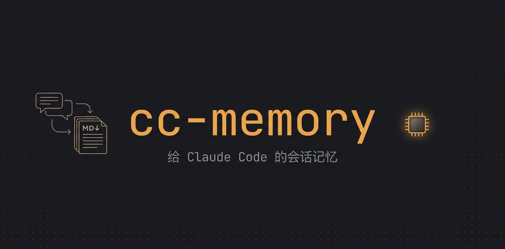
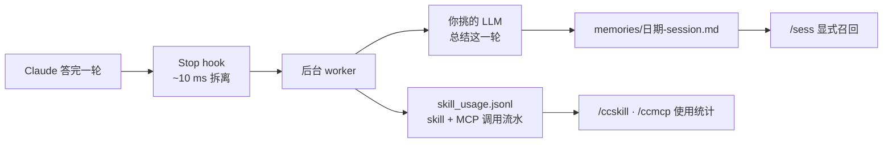

[English](README.md) | 简体中文

<div align="center">

# cc-memory

<p align="center">
  
</p>

> *「写要自动而廉价，读要显式而可控。」*

[](LICENSE)
[]()
[]()
[]()

<br>

**给 Claude Code 的逐轮会话记忆 + 终身使用统计。**

<br>

1 个 Stop hook、1 个你自己挑的 LLM、一堆纯 markdown 文件。<br>
每轮对话后台自动总结；不问就一个 token 都不进你的上下文。<br>
顺手还把你每一次 skill / MCP 调用记成永久流水——这些数据 Claude Code 自己 30 天就删了。

<br>

[看效果](#看效果) · [安装](#安装) · [用数字说话](#用数字说话) · [工作原理](#工作原理)

</div>

---

## 看效果

**随时召回任何历史 session，不用每次开机都交"上下文税"：**

```text
你     ❯ /sess dab 变换器
Claude ❯ 找到了——2026-05-24，本项目：
         轮次 3：调 DAB 仿真移相角；0.3 p.u. 负载以下丢 ZVS。
         先试了降 fs（失败——磁件饱和），最终把死区 180 ns → 240 ns 解决。
你     ❯ 当时报错原话是什么？
Claude ❯ （sess 自动切 --raw 读原始 transcript）"Derivative of state '1'
         in block ... at time 0.00132 is not finite."
```

历史不会被塞进每个新 session。记忆躺在磁盘上，**你拉它才进来**——先给摘要，要原话再下钻无损原文。

**`/ccskill`、`/ccmcp` 一眼看清你真正在用什么工具：**

```text
$ ccmem mcp-stats          # ← Claude Code 里输 /ccmcp
MCP server     次数    首次        最近        top tools
matlab         10686  2026-05-12  2026-06-10  evaluate_matlab_code×9670
tavily           706  2026-05-11  2026-06-09  tavily_search×615
filesystem       244  2026-05-14  2026-06-07  read_file×142
...
共 18 个 MCP server，总调用 12232 次
```

Claude Code 的原始 transcript 30 天就清掉，这份流水**永久保留**。作者自己一查才发现：一个 MCP server 占了全部调用的 87 %，另外三个纯吃灰。

---

## 为什么这么设计

借鉴 [claude-mem](https://github.com/thedotmack/claude-mem)，两处刻意反着来：


| 维度 | claude-mem | cc-memory |
|---|---|---|
| Hook 数量 | 5 个（SessionStart / UserPromptSubmit / PostToolUse / Stop / SessionEnd） | **1 个**（Stop，逐轮 append） |
| 崩溃代价 | 取决于 SessionEnd 有没有触发 | **最多丢没答完的最后一轮** |
| 总结引擎 | Claude agent-sdk | **你已有的任何 LLM，或本地免费模型** |
| 新 session 自动注入 | 有 | **没有——显式 `/sess`** |
| 存储 | SQLite + Chroma 向量库 | **markdown + grep** |

1. **不自动注入。** 上下文窗口是 session 里最稀缺的资源。自动注入 = 每次开机都被强制扣一笔"可能用不上的历史"税，连"这次要不要历史"的判断权都被拿走了。
2. **默认不跨项目检索。** 认真用 Claude Code 的人本来就按项目组织工作；跨项目语义检索捞回来的多半是同名不同义的噪声。`/sess` 默认锁当前项目，`--all` 按需放开。

---

## 用数字说话

| 指标 | 数值 |
|---|---|
| **需要的 hook** | 1 个——只有 Stop |
| **hook 延迟** | ~10 ms（worker 后台拆离，CC 零等待） |
| **崩溃 / `Cmd+Q` 丢多少** | 最多 1 轮（没答完的那轮） |
| **pip 安装** | 0 个——纯 Python 标准库（urllib + json + fcntl） |
| **代码总量** | 2230 行，一下午能整体读完 |
| **单轮摘要** | ~300 字，按"别的模型只看摘要就能接手"标准写 |
| **LLM provider** | 9+ 家（OpenAI / Anthropic / DeepSeek / OpenRouter / Together / Groq / Ollama / vLLM / 智谱），2 套协议自动嗅探 |
| **每 session 注入的上下文** | 0 token，除非你主动拉 |
| **使用统计保留期** | 无限——不受 Claude Code 30 天 transcript 清理影响 |
| **安装耗时** | ~3 分钟，让 Claude Code 自己装 |

---

## 工作原理




**1. 拆离** —— Claude 答完一轮，Stop hook 把事件写进临时文件、fork 出后台 Python worker，~10 ms 内返回。CC 全程不阻塞。

**2. 总结** —— worker 从 CC 的 transcript 抽出这一轮，调你配置的 LLM（OpenAI Chat 或 Anthropic Messages 任一协议端点）写 ~300 字摘要；失败和绕过的弯路也写，不只记最终方案。

**3. 追加** —— 一个 session 一个 markdown 文件，frontmatter + 逐轮分节，fcntl 排它锁防并发；容量超限 FIFO 剪枝，不吃磁盘。

**4. 记流水** —— 顺路把这一轮里每次 `Skill`、`mcp__*` 工具调用追加进 `skill_usage.jsonl`，按 tool-call id 去重。不加新 hook，不花 LLM 钱。

读是另一条显式路径：`/sess` 查记忆，`/ccskill` `/ccmcp` 查使用统计，`--raw` 下钻 CC 无损原文。

---

## 安装

```bash
git clone https://github.com/Zane456/cc-session-memory.git
cd cc-session-memory
claude
```

进 Claude Code 后粘贴：

> 请按本 repo 根目录 `INSTALL.md` 第 3 节"标准化安装步骤"帮我装 cc-memory。我用全局模式（`--global`）。每完成一步打勾汇报，遇到意外停下来问我。

hook、config、`/sess` `/sessme` `/ccskill` `/ccmcp` 四个 skill 全由 Claude Code 自己配好。手动安装路径和完整 [Provider 矩阵](INSTALL.md#provider-矩阵)（OpenAI / Anthropic / DeepSeek / Ollama / …）见 [INSTALL.md](INSTALL.md)。

以后想换 provider，对 Claude Code 说一句"把我的 cc-memory 配置换成 deepseek"就行。

---

## 日常用法

| 你输入 | 你得到 |
|---|---|
| `/sess` | 本项目上个 session 的摘要全文 |
| `/sess <关键词>` | 搜本项目历史记忆 |
| `/sess all 3` | 跨所有项目最近 3 个 session |
| `/sessme` | **只调本窗口自己这个 session**——按 session id 精确锁定，多窗口并行时绝不串到旁边窗口的记忆（`/clear` 之后尤其好用） |
| 「上次原话是怎么说的？」 | sess 自动切 `--raw` 读原始 transcript |
| `/ccskill` | 你调过的每个 skill：次数 / 首次 / 最近 / 项目数 |
| `/ccmcp` | MCP server 排行，附每家 top 工具 |

同一份数据也能在 shell 里直接跑：

```bash
python3 memory_system/cli/ccmem.py last-session            # 摘要
python3 memory_system/cli/ccmem.py find "<关键词>" --raw    # 无损搜索
python3 memory_system/cli/ccmem.py skill-stats --by day    # 使用趋势
python3 memory_system/cli/ccmem.py mcp-stats               # MCP 排行
```

---

## 隐私（结构上保证，不靠自觉）

- **记忆不出你的机器。** `memories/` 默认 gitignore；摘要和流水都是本地纯文本，随便看、grep、改、删。
- **API key 进不了 git** —— 存在 `~/.config/cc-memory/config.json`（chmod 600），`.gitignore` 还兜底拦截一切误入的 `config.json`。
- **失败不打扰** —— LLM 报错只写本地日志，hook 永远 exit 0，绝不弄坏你的 Claude Code session。

---

## 仓库结构

```
cc-session-memory/
├── INSTALL.md                       # 安装指南（从这里开始）
├── memory_system/
│   ├── hooks/session_end.sh         # 10 ms 拆离器
│   ├── hooks/summarize.py           # 后台 worker：总结 + 记流水
│   ├── skill_usage.py               # skill/MCP 调用抽取共享模块（132 行）
│   ├── cli/ccmem.py                 # 检索 + 统计 CLI
│   └── bin/prune_cc_transcripts.py  # 给 ~/.claude/projects 封顶
├── skills/                          # /sess · /sessme · /ccskill · /ccmcp 模板
├── memories/                        # 你的摘要（gitignore）
└── docs/images/
```

完整架构推演：[DESIGN.md](DESIGN.md)。

---

<div align="center">

<br>

*写要自动而廉价，读要显式而可控。*

<br>

⭐ 如果 cc-memory 帮你记住过什么，点个 star。

<br>

**Zane456** —— 电力电子方向研究者，每天用 Claude Code 干活

| 平台 | 链接 |
| :--- | :--- |
| 🐙 GitHub | [@Zane456](https://github.com/Zane456) |

<br>

MIT License © [Zane456](https://github.com/Zane456)

</div>
